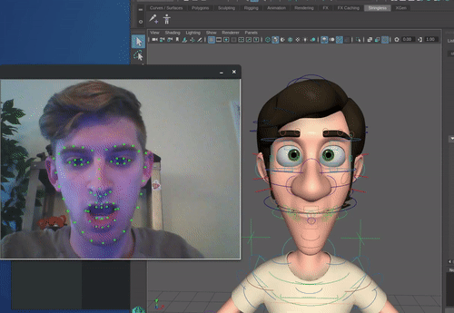

# Stringless
[](https://travis-ci.org/justint/stringless)



Stringless is a real-time, markerless, single-camera facial motion capture system. By using [dlib](http://dlib.net/) facial landmark detection, Stringless captures facial motion data as a collection of data points and sends it to an Autodesk Maya plug-in, where a user can map the motion capture data to a rigged face model. It was originally built as a pseudo-thesis project for my CS undergraduate degree at SJSU, but is now a continual work in progress with updates and added features.

For an overview of the system's design, operation flow, and current issues, please see [this presentation](http://justintennant.me/Stringless_NASA_Presentation.pdf), which was given live at the NASA Ames Research Center in June 2017.

I accept pull requests, and issues for bugs + feature requests are welcome.

## Build instructions

Stringless server requires [OpenCV](http://opencv.org/) and [dlib](http://dlib.net), and the Maya plug-in requires Autodesk Maya.

1. Clone a copy of Stringless:

    `$ git clone https://github.com/octop1/stringless.git`

2. Make a build directory and compile:

    ```
    $ cd stringless

    $ mkdir build

    $ cd build

    $ cmake .. -DUSE_AVX_INSTRUCTIONS=ON -DMAYA_VERSION=2017

    $ make
    ```

    Change the `DMAYA_VERSION` arg to whichever version of Maya you're compiling for. To compile the server alone (no Maya plug-in, run `cmake .. -DUSE_AVX_INSTRUCTIONS=ON -DBUILD_MAYA=OFF`

## Running Stringless

To initiate the server process using the default camera (camera 0):

`$ src/Stringless -p ../ext/dlib/shape_predictor_68_face_landmarks.dat`

Use the `-cn=<arg>` flag to specify a different camera.

To start up the Maya plug-in:

1. Load up the stringless-maya plug-in, copy the [StringlessMaya.mel](https://github.com/justint/stringless/blob/master/stringless-maya/src/StringlessMaya.mel) script into your Maya scripts directory
2. Enter `source StringlessMaya` into the Maya MEL command line
3. Enter `createStringlessCap "<name>"` into the Maya MEL command line, where `<name>` is your preferred capture node name

Once the capture device node is constructed, the node requires a neutral face pose to be defined before reading capture data. While the Stringless server is running, hold the actor's face still and enter `calibrateNeutralFace("<name>_Device")` into the MEL command line. The `<name>_Device` node's Live button will now be enabled. You can now read live capture data by enabling the Live checkmark.

To use the capture data on a rig, you can use the `Constrain > Parent` tool to parent the Stringless rig joints (found within the `<name>_Face` node in the Outliner) to your own rig.

### Optimizing performance

Use the `-d`/`--dsr` flag to specify a downsample ratio. This scales down the captured image frames, speeding up face detection greatly.

*Example*: `./Stringless ... -d 2` will scale down the image by a half (1/**2**).

Use the `-s`/`--sr` flag to specify a sampling rate for face detection. By default Stringless attempts to detect faces in every frame, but if the actor is keeping their head fairly still during captures, the interval between sampled frames can be raised without any noticeable drop in capture quality.

*Example*: `./Stringless ... -s 3` will look for faces every three frames, and will use the face location data from the previously sampled frame to define the facial landmark detection region.

When compiling Stringless, it is important to use the `-DUSE_AVX_INSTRUCTIONS=ON` flag with cmake - this instructs your compiler to use especially optimized [Advanced Vector Extension](https://en.wikipedia.org/wiki/Advanced_Vector_Extensions) instructions, which came about in early 2011. If you're using a pre-2011 CPU, use the `-DUSE_SSE4_INSTRUCTIONS=ON` flag instead (the next best optimal instructions).

## Contents

```
/ext                3rd-party libraries and dependencies

/src                Stringless server source

/stringless-maya    Stringless Maya plug-in
```

## Licensing

Stringless is released under the Boost Software License; its dependency licenses can be viewed in the `LICENSE` file.

## Author

[Justin Tennant](http://justintennant.me), 2017
